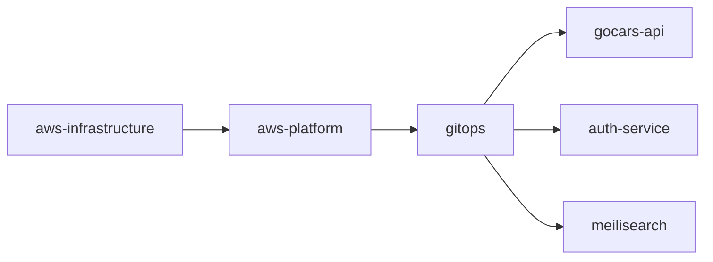
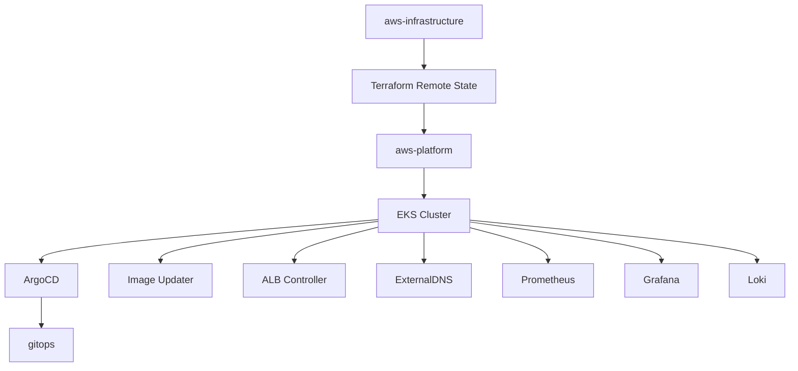
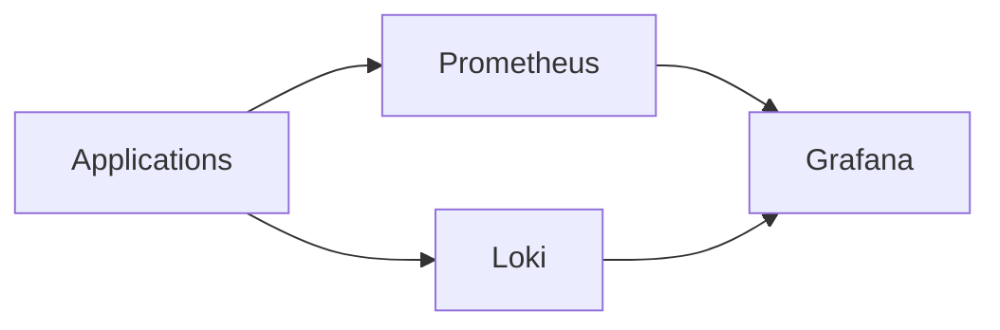
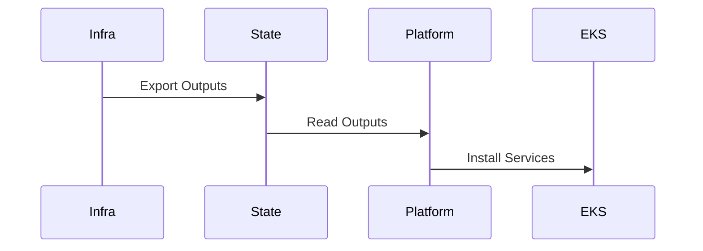
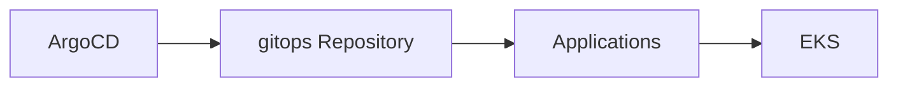
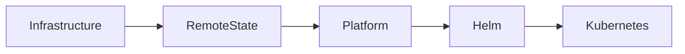

# AWS Platform

Terraform-managed Kubernetes platform services running on Amazon EKS.

## Overview

This repository installs and manages the shared platform services required by workloads running on Amazon EKS.

It serves as the platform layer between infrastructure provisioning and application deployment.

## Platform Architecture



---

## Responsibilities

* Install ArgoCD
* Install ArgoCD Image Updater
* Install AWS Load Balancer Controller
* Install ExternalDNS
* Install Prometheus
* Install Grafana
* Install Loki
* Configure platform-level IAM integration
* Configure GitOps foundation

---

## Architecture



---

## Platform Services

| Service                      | Purpose                      |
| ---------------------------- | ---------------------------- |
| ArgoCD                       | GitOps deployment engine     |
| Image Updater                | Automated image promotion    |
| AWS Load Balancer Controller | ALB integration              |
| ExternalDNS                  | DNS automation               |
| Prometheus                   | Metrics collection           |
| Grafana                      | Dashboards and visualization |
| Loki                         | Centralized logging          |

---

## Platform Capabilities

* GitOps Deployments
* Automated Image Promotion
* DNS Automation
* AWS Load Balancer Integration
* Centralized Logging
* Metrics Collection
* Dashboarding
* Kubernetes Platform Management
* Infrastructure Observability
* Application Observability

---

## Observability Stack

```text
Prometheus
├── Kubernetes Metrics
├── Application Metrics
├── Infrastructure Metrics
└── AWS Metrics

Grafana
├── Infrastructure Dashboards
├── Kubernetes Dashboards
├── Application Dashboards
└── Operational Dashboards

Loki
├── Kubernetes Logs
├── Application Logs
└── Platform Logs
```

---

## Monitoring Architecture



---

## Repository Structure

```text
aws-platform/

├── namespace.tf
├── argocd.tf
├── argocd-root-app.tf
├── argocd-image-updater.tf

├── ingress-acm.tf
├── ingress-alb-controller.tf
├── ingress-external-dns.tf
├── ingress-argocd.tf
├── ingress-grafana.tf

├── monitoring.tf

├── providers.tf
├── variables.tf
├── outputs.tf
├── remote-state.tf
├── versions.tf

├── policies/
│   └── alb-controller-policy.json
│
└── secrets/
```

---

## Dependencies

This repository depends on outputs exported by aws-infrastructure.

Required Terraform Outputs:

| Output            | Purpose             |
| ----------------- | ------------------- |
| cluster_name      | EKS access          |
| oidc_provider_arn | IRSA configuration  |
| oidc_provider_url | OIDC authentication |

---

## Deployment Chain

```text
aws-infrastructure
        ↓
aws-platform
        ↓
gitops
        ↓
ArgoCD
        ↓
Applications
```

---

## Data Flow



---

## GitOps Integration



---

## Security Architecture

### Security Controls

* IAM Roles for Service Accounts (IRSA)
* OIDC Authentication
* Least Privilege IAM Policies
* GitOps Access Control
* Kubernetes RBAC
* TLS-secured ingress
* Namespace Isolation

---

## Deployment Flow



---

## Design Decisions

### Why ArgoCD?

ArgoCD enables declarative GitOps deployments and continuous reconciliation.

### Why ExternalDNS?

ExternalDNS automates DNS record management from Kubernetes resources.

### Why Prometheus?

Prometheus provides cloud-native metrics collection and monitoring.

### Why Grafana?

Grafana provides dashboards and operational visibility.

### Why Loki?

Loki provides centralized logging for platform and application workloads.

---

## Future Improvements

* Alertmanager
* Karpenter
* OpenTelemetry
* Distributed Tracing
* Cost Monitoring
* Multi-Environment Deployments

---

## Technologies

* Terraform
* Helm
* Kubernetes
* ArgoCD
* ArgoCD Image Updater
* Prometheus
* Grafana
* Loki
* ExternalDNS
* AWS Load Balancer Controller

---

## Related Repositories

* aws-infrastructure
* gitops
* gocars-api
* auth-service

---

## License

Licensed under the MIT License.